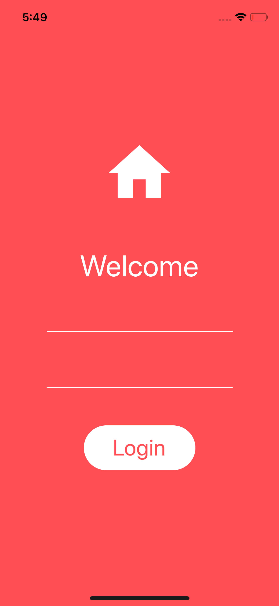

## ScreenShot

<p align="center" >
    
 </a>

## Video

- [Video](http://sneakersmap.fr/img/airbnb.gif)

## ✅ Functionalities

- LogIn.
- Get appartement via AirBNB Api
- Display appartement with information
- click on it for display map marker in Google map
- Navigate on BottomVavigator
- Log out

## Directory Structure

```bash

AIRBNB
├── expo
├── assets
├── components
├── containers
│   ├── AuthLoadingScreen
│   ├── HomeScreen
│   ├── Map
│   ├── OtherScreen
│   ├── SettingsScreen
│   ├── SignInScreen
│   └── TabNavigator
├── App.js
├── app.json
├── babel.config.js
├── .gitignore
├── package-lock.json
├── package.json
└── README.md

```

## Running the project

Clone this repository :

```bash
git https://github.com/rudboy/AirBnB

cd AirBnB
```

Start the server:

```bash
npm start
```

Build the project

```bash
npm run build
```

## Built With

- [JavaScript](https://developer.mozilla.org/bm/docs/Web/JavaScript)
- [ReactNative.js](https://facebook.github.io/react-native/)
- [Create React App](https://facebook.github.io/create-react-app/docs/getting-started)

## Acknowledgments

- [Create React Native App with Expo](https://expo.io/learn).
- I used a component for API request [axios](https://www.npmjs.com/package/axios)
- I used a component for Add Icons [@expo/vector-icons](https://www.npmjs.com/package/@expo/vector-icons)
- Deploy React to github pages [codeburst](https://codeburst.io/deploy-react-to-github-pages-to-create-an-amazing-website-42d8b09cd4d)
